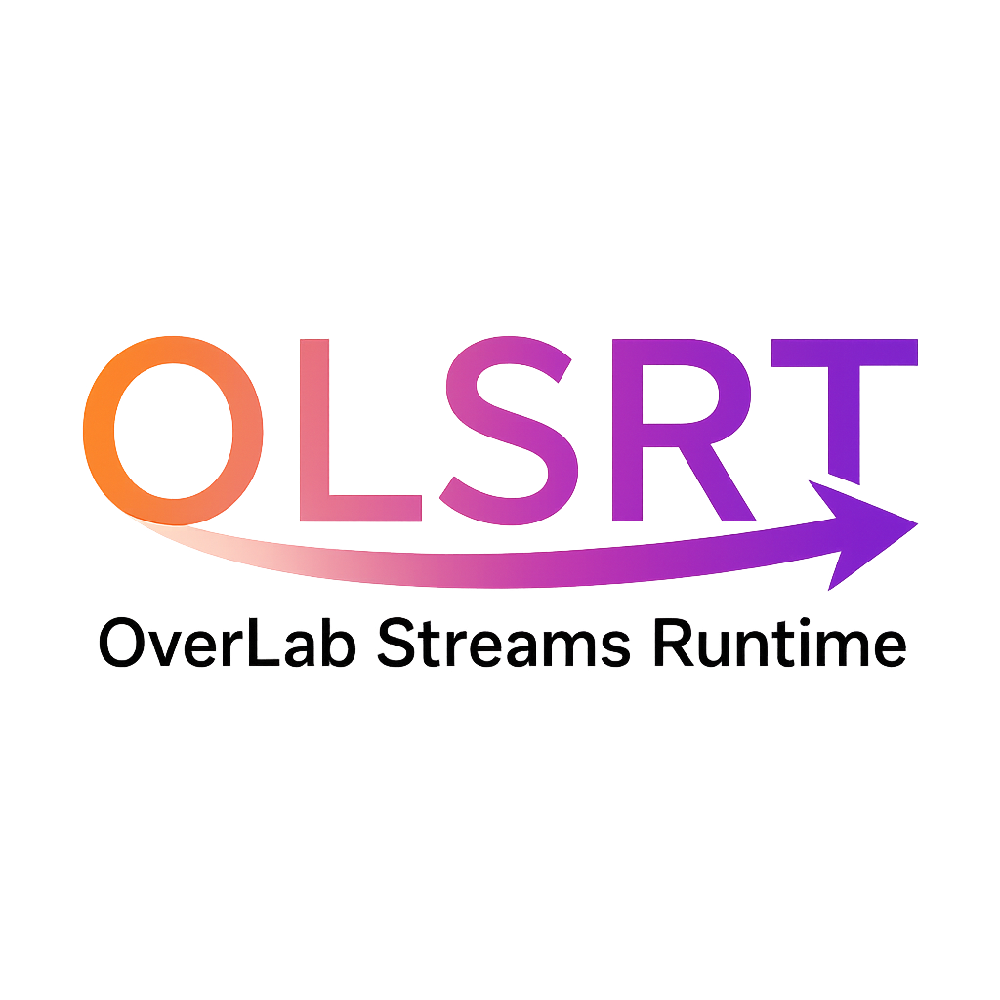

# ⚡ OLSRT – OverLab Streams Runtime
[](https://en.wikipedia.org/wiki/C_(programming_language))
[](#build-status)
[](#license)
[](#build-olsrt-yourself)
[-brightgreen.svg)](#status)
[](#status)
[](#contributing)


---

> NOTE: OLSRT Atom v1.1 coming soon...

---

## 🤔 What is OLSRT?
**OLSRT** (**OverLab Streams Runtime**) is not your average runtime.<br/>
It’s a **universal engine** – designed to power **all languages**.<br/>
If your language can talk to C, it can vibe with **OLSRT**. 🎉

---

## 💡 Why OLSRT?
Once upon a time, **OLSRT** was a fragile experiment – weaker than `libuv`.  
But that was yesterday. ⏳  

Today, **OLSRT** is a **battle‑tested, production‑ready runtime** with serious muscle.  
Strong enough for **enterprise workloads**, yet hackable enough for indie devs. 🏢💪🎸  

From garage‑style tinkering to a universal runtime, **OLSRT** now delivers:
- ⚡ **Concurrency**: Actors, Async/Await, Coroutines, Fibers
- 🔒 **Synchronization**: Locks, Mutexes, Semaphores, Supervisors
- 🔄 **Reactive/Dataflow**: Stream‑based programming, pipelines
- ⏱️ **Scheduling/I/O**: Event Loop, Poller, Deadlines
- 🌊 **Composability**: Streams, Futures, Promises, Parallel execution

**Minimal. Hackable. Ruthless.**  
More powerful than the hype, sharper than the trends. 🖤

---

## 📊 Status
- **Production‑ready (v1.0)** ✅  
- Stable builds available  
- SDK Bindings & Documentation cooking 🍳  

---

## 🖥️ Build status
- 🐧 Linux: ✅ Solid  
- 🪟 Windows: 🔜 Next Target
- 🍎 macOS: 🔜 Coming Soon
- 🐚 BSD: 🔜 Preview

---

## Documention
Documention is planned and will available soon.

---

## Quick Examples
Quick Examples are planned and will available very soon.

---

## 🛠️ Build OLSRT Yourself
Two ways to unleash the beast:

- **Prebuilt binaries**: Grab the `.so` / `.dll` and drop it in your project.  
- **Build from source**: Compile OLSRT yourself with **Make** (preferred) or **CMake**.

---

### 🚀 Build with **CMake**
1. Clone with minimal history:
   ```bash
   git clone --depth 1 https://github.com/OverLab-Group/OLSRT.git
   ```
   Or download without Git history:
   ```bash
   wget https://github.com/OverLab-Group/OLSRT/archive/refs/heads/main.zip
   unzip main.zip
   ```
2. Enter the project directory:
   ```bash
   cd OLSRT
   ```
3. Create a build directory:
   ```bash
   mkdir build && cd build
   ```
4. Configure & build:
   ```bash
   cmake ..
   cmake --build .
   ```

> ⚠️ Note: CMake builds are supported but **not the main stage**.  
> The OverLab Group dev team runs with Makefiles for validation. 🎯

---

### 🛠️ Build with **Make** (recommended)
1. Clone with minimal history:
   ```bash
   git clone --depth 1 https://github.com/OverLab-Group/OLSRT.git
   ```
   Or download without Git history:
   ```bash
   wget https://github.com/OverLab-Group/OLSRT/archive/refs/heads/main.zip
   unzip main.zip
   ```
2. Enter the project directory:
   ```bash
   cd OLSRT
   ```
3. Build for your platform:
   ```bash
   make <platform>
   ```
   Replace `<platform>` with:  
   `linux`, `windows`, `bsd`, `apple`, or `all-platforms`.

---

## 📅 Release Timeline
OLSRT versions aren’t just numbers — they’re milestones with names and stories:

| Version | Codename | Highlights |
|---------|----------|------------|
| v0.1    | **Initialize Core** | First spark. Skeleton features. |
| v1.*    | **Atom**   | First stable release. (_**We are here**_) |
| v2.*    | **Apollo** | 66 networking protocols. 🚀 |
| v3.*    | **Nova**   | Virtualization support. 💥 |
| v4.*    | **Core**   | Utilities foundation. |
| v5.*    | **Spark**  | Utilities expansion begins. ✨ |
| v6.*    | **Orion**  | More utilities. 🌌 |
| v7.*    | **Cosmos** | Vast scope. 🌠 |
| v8.*    | **Hermes** | Compiler era begins. 📜 |
| v9.*    | **Kernel** | Advanced runtime core. 🧩 |
| v10.*   | **Stream** | Architectures added. 🌊 |
| v11.*   | **Flow**   | Full OS support. 🔗 |
| v12.*   | **Wave**   | 30% language coverage. 🌊 |

---

## 🤝 Contributing
We’re not a corporate army.  
We’re a crew of builders, breakers, and dreamers. 🔄💥  

Join us, and you’re not just a contributor.  
You’re part of the legend. 📖🔥  

---

## 📜 License
Apache 2.0 – free to use, remix, and share. 🆓  

---

You can also visit [Dev.To Blog](https://dev.to/javadinteger/olsrt-overlab-streams-runtime-the-first-language-agnostic-runtime-of-overlab-group-5b8c?utm_source=github.com) for more.

Current milestone: **v1.0 (Atom)**  
`By OverLab Group`
