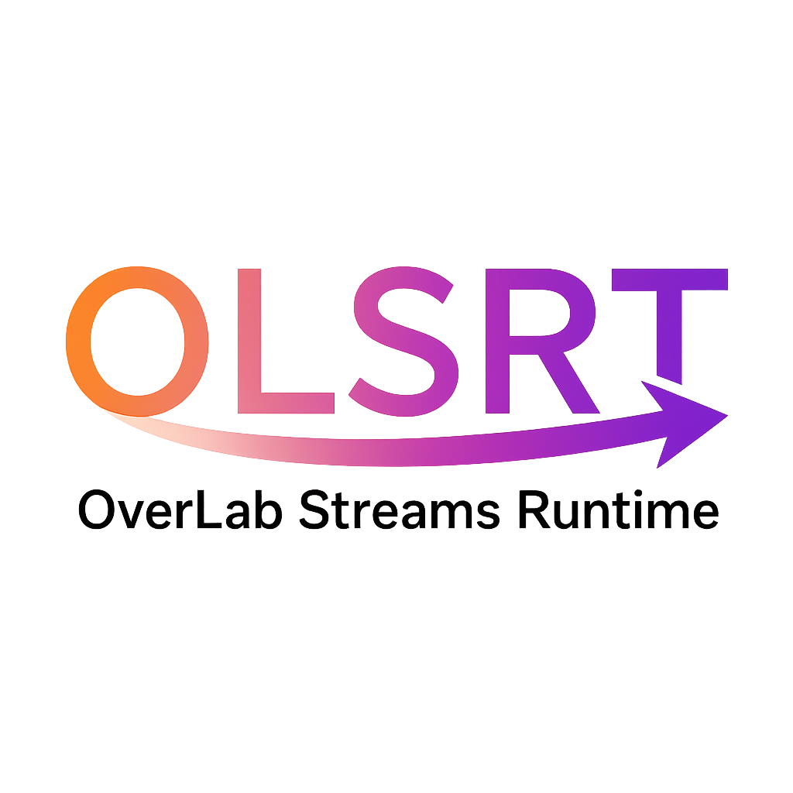

# ⚡ OLSRT – OverLab Streams Runtime

[](https://en.wikipedia.org/wiki/C_(programming_language))
[](#build-status)
[](#license)
[](#build-olsrt-yourself)
[](#status)
[](#documentation)
[](#contributing)


---

> **NOTE:** OLSRT **v1.3.1** is the current stable release, produced by the
> Wave 1 stabilization effort that fixed 11 real bugs in v1.3.0 and added
> a full regression suite (22 assertions, ASan / UBSan / TSan clean).
>
> **NOTE:** v1.3.x is fully working on **Linux** and **BSD**. Windows and
> macOS are planned for v2.0.
>
> **NOTE:** 7 self-contained demos live in [`demos/`](demos/) — from
> actor ask/reply to a working HTTP server.
>
> **NOTE:** See [`ROADMAP.md`](ROADMAP.md) for the full v1.3.x → v2.0 plan,
> including the NWP (Non-Waiting Paradigm) integration scheduled for v1.3.6.

---

## 🤔 What is OLSRT?

**OLSRT** (**OverLab Streams Runtime**) is a **universal runtime engine** —
designed to power **any language**. If your language can talk to C, it can
build on OLSRT.

Unlike a single-purpose library, OLSRT provides a full concurrency
substrate: actors with process isolation, an event loop with timers and
I/O, promises and futures with continuations, channels with backpressure,
green threads with work stealing, reactive/stream abstractions, supervisor
trees, and a dataflow graph engine — all in portable C11.

---

## 💡 Why OLSRT?

OLSRT started as a fragile experiment, smaller than `libuv`. Today it is a
production-ready runtime with:

- ⚡ **Concurrency** — Actors, Async/Await, Coroutines, Green Threads
- 🔒 **Synchronization** — Locks, Mutexes, Semaphores, Supervisors
- 🔄 **Reactive/Dataflow** — Streams, backpressure, operator composition
- ⏱️ **Scheduling/I/O** — Event Loop, Poller (epoll/kqueue/select), Deadlines
- 🌊 **Composability** — Channels, Futures, Promises, Parallel pools
- 💥 **Made by OverLab Group** — HCR (Hot-Coding References) and
  ORoutines (OLSRT Coroutines) are planned for v1.3.4 and v1.3.6

**Minimal. Hackable. Ruthless.**

---

## 📊 Status

| Metric | Value |
|--------|-------|
| **Current release** | v1.3.2 (Actor Scheduler) |
| **Previous stable** | v1.0.0 (first public release) |
| **Regression tests** | 22 assertions, 0 failures |
| **Sanitizer status** | ASan ✅ · UBSan ✅ · TSan ✅ |
| **Demos** | 7 (all working) |
| **Active development** | v1.3.3 (Dataflow Cleanup) |

---

## 🖥️ Build status

| Platform | Status |
|----------|--------|
| 🐧 **Linux** | ✅ Solid (x86_64 tested; aarch64 CI pending) |
| 🐚 **BSD** | ✅ Solid (FreeBSD, OpenBSD; NetBSD untested) |
| 🪟 **Windows** | 🔜 Planned for v2.0 (IOCP backend) |
| 🍎 **macOS** | 🔜 Planned for v2.0 (kqueue native backend) |

---

## Documentation

- **API reference** — `docs/index.html` (interactive, JSDoc-style)
- **Doxygen** — run `doxygen Doxyfile` in the project root
- **Sphinx** — `cd source && sphinx-build -b html . ../docs/sphinx`
- **Roadmap** — [`ROADMAP.md`](ROADMAP.md)
- **Changelog** — [`docs/CHANGELOG.md`](docs/CHANGELOG.md)
- **Demo guide** — [`demos/README.md`](demos/README.md)

---

## Quick Demos

Seven self-contained programs that exercise the core primitives:

```bash
cd demos
make
./01_hello_actor    # Actor + ask/reply + promises
./02_channel        # 1,000,000 messages through a bounded channel
./03_parallel       # 4-worker pool, 100 tasks
./04_timers         # Event loop, one-shot + periodic timers
./05_promise        # Promise states, .then() continuations
./06_dataflow       # Graph: source → doubler → sink
./07_http_server    # Minimal HTTP server on 0.0.0.0:8080
```

See [`demos/README.md`](https://demos/README.md) for details and expected output.

Benchmarks observed on an **AMD E2-1800 (dual-core, 1.7 GHz)**:

| Demo | Metric |
|---|---|
| `02_channel` | 1,000,000 messages in 2.588 s → **~386k msg/s** |
| `03_parallel` | 100 tasks in 86 ms across 4 workers |
| `04_timers` | periodic timer drift **< 2 µs** over 6 fires |
| `07_http_server` | served 3 sequential curl requests correctly |

---

## 🛠️ Build OLSRT Yourself

### Prerequisites

- A C11 compiler (GCC ≥ 9 or Clang ≥ 10 recommended)
- `make` or `cmake` ≥ 3.12
- On Linux: `libnuma-dev` (optional — NUMA support is compiled out if missing)
- `libpthread`, `librt`, `libdl` (standard)

### Clone

```
git clone --depth 1 https://github.com/OverLab-Group/OLSRT.git
cd OLSRT
```

Or download the ZIP:

```
wget https://github.com/OverLab-Group/OLSRT/archive/refs/heads/main.zip
unzip main.zip && cd OLSRT-main
```

### Build with Make (recommended)

```
make linux                       # build for Linux x86_64
make TARGET=linux ARCH=aarch64   # cross-build for aarch64
make clean                       # clean current target
make help                        # show all targets
```

Output: `bin/<platform>/<arch>/libolsrt.so`.

### Build with CMake

```
mkdir build && cd build
cmake .. -DCMAKE_BUILD_TYPE=Release
cmake --build . -j
```

### Run the test suite

```
# Wave 1 regression suite, under ASan + UBSan + TSan
python3 verify.py
```

Expected output: `[OK] asan_tests: PASS`, `[OK] tsan_tests: PASS`.

### Platform notes

- **Linux / BSD** — all features available.
- **Windows / macOS** — the event loop falls back to `select`, which caps
file descriptors at 64. Production support arrives in **v2.0** with
IOCP (Windows) and native kqueue (macOS).

---

## 📅 Release Timeline

| Version | Codename | Highlights | Status |
|---|---|---|---|
| v0.1 | **Initialize Core** | First spark, skeleton features | ✅ |
| v1.0 | **Atom** | First public release | ✅ |
| v1.2 | **Atom (stable)** | Full Linux/BSD support | ✅ |
| v1.3.0 | **Atom (v1.3)** | Actors, Supervisors, Coroutines, platform module | ✅ |
| **v1.3.1** | **Wave 1 Stabilization** | 11 bug fixes, 22 tests, sanitizer-clean | ✅ **CURRENT** |
| v1.3.2 | **Actor Scheduler** | Green-thread-driven actor loop | 🔜 Next |
| v1.3.3 | **Dataflow Cleanup** | Edge inbox fix, cosmetic warnings, LSan re-enable | 🔜 |
| v1.3.4 | **ORoutines** | Goroutine-like API + HCR primitives | 🔜 |
| v1.3.5 | **Supervisor 2.0** | Hierarchical supervision, restart strategies | 🔜 |
| v1.3.6 | **NWP MVP** | Non-Waiting Paradigm, Branch Units, NWL | 🔜 |
| v1.3.7 | **NWP Integration** | Benchmarks, docs, SDK bindings | 🔜 |
| v2.0 | **Apollo** | Cross-platform (IOCP/kqueue) + 66 network protocols | 🔮 |
| v3.0 | **Nova** | Virtualization support | 🔮 |
| v4.0 | **Core** | Utilities foundation | 🔮 |
| v5.0 | **Spark** | Utilities expansion | 🔮 |
| v6.0 | **Orion** | More utilities | 🔮 |
| v7.0 | **Cosmos** | Vast scope | 🔮 |
| v8.0 | **Hermes** | Compiler era begins | 🔮 |
| v9.0 | **Kernel** | Advanced runtime core | 🔮 |
| v10.0 | **Stream** | Architectures added | 🔮 |
| v11.0 | **Flow** | Full OS support | 🔮 |
| v12.0 | **Wave** | 30% language coverage | 🔮 |

See [`ROADMAP.md`](https://roadmap.md/) for exhaustive details.

---

## 🤝 Contributing

We're not a corporate army. We're a crew of builders, breakers, and dreamers.

Before opening a PR:

1. Read [`ROADMAP.md`](https://roadmap.md/) to see where the project is heading.
2. Run `python3 verify.py` locally — all four checks must be green.
3. Format code to match the existing style (4-space indent, `ol_` prefix
for public API, `OL_` for macros).
4. Update `docs/CHANGELOG.md` under an "Unreleased" section.
5. Sign off your commits with `git commit -s`.

Pull requests that break the sanitizer pass will not be merged.

---

## 📜 License

Apache 2.0 — free to use, remix, and share. See [`LICENSE`](https://license/).

Current milestone: **v1.3.2 (Actor Scheduler)**

`By OverLab Group`
