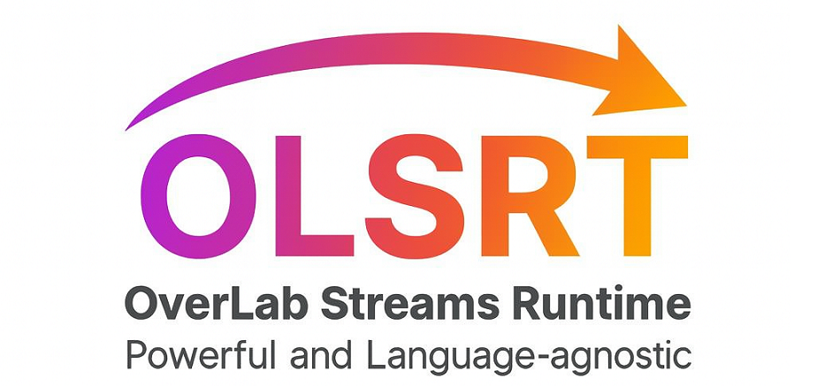

## What is OLSRT?
**OLSRT** (**OverLab Streams Runtime**) is not just another runtime. 
**OLSRT** is an **universal runtime** - designed for **all languages**. 
If your language can talk to C, it can talk to **OLSRT**.

## Why **OLSRT**?
At the very begining, **OLSRT** was a weak runtime - even weaker that `libuv`, a library from GitHub's history. 
But that was the past! 

Today, **OLSRT** has evolved into a **complete & production-ready runtime** with advanced capabilities. Powerful enough to be used in **enterprise-scale projects**. 

from humble experiments to a universal runtime, **OLSRT** now delivers:
- Modern concurrency primitives (Actors, Async/Await, Coroutines, and Green Threads/Fibers)
- Robust synchronization (Locks & Mutex, Semaphores, and Supervisors)
- Reactive and Dataflow programming
- Event Loop, Poller, and Deadlines
- Streams, Futures, Promises, and Parallel execution

**Minimal. Hackable. Yet more powerful than Trends**

## Status
**Production-ready (V1.0)** 
Stable builds available (`libolsrt.so`, `olsrt.dll`, `libolsrt.dylib`) 
SDK Bindings & Documentions in Progress

## 📅 Release Timeline
OLSRT versions are not just numbers — each milestone has a name and a story:

| Version | Codename | Highlights |
|---------|----------|------------|
| v0.1		|	**Initialize Core** | The first version of OLSRT, nothing was here, only some key features. |
| v1.*    | **Atom**   | First stable release. Advanced features, but still small compared to the future. (_**We are here**_) |
| v2.*    | **Apollo** | Added 66 networking protocols and port management. Like launching Apollo 🚀 |
| v3.*    | **Nova**   | Virtualization support introduced. A stellar explosion of new possibilities. |
| v4.*    | **Core**   | Focus on Utils until v8. Named Core as a farewell to the runtime’s foundation. |
| v5.*    | **Spark**  | Utilities expansion begins. The spark of new tools. |
| v6.*    | **Orion**  | More utilities. Inspired by the powerful constellation. |
| v7.*    | **Cosmos** | Utilities broaden further. Vast and cosmic scope. |
| v8.*    | **Hermes** | End of utilities, start of Compiler & OLLC. Messenger of a new era. |
| v9.*    | **Kernel** | Advanced runtime core, like a real kernel. Foundation for future versions. |
| v10.*   | **Stream** | Architectures added. Flowing runtime stream. |
| v11.*   | **Flow**   | Full OS support. Seamless flow across systems. |
| v12.*   | **Wave**   | Massive expansion. 30% of programming languages supported. 🌊 |

## Contributing
We are not a big team. 
We are just trying, failing, and trying more, again. 
If you join us, you won't just be a contributor. 
You'll be part of the story.

## License
Apache 2.0 - free to use, modify, and share.

Current milestone: v1.0 (Atom) 
`By OverLab Group`
